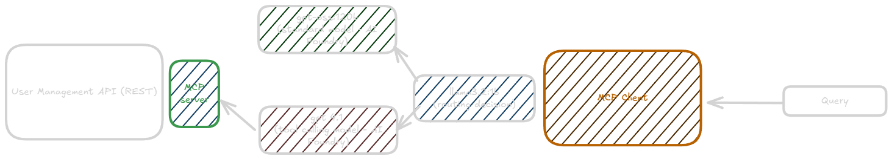

# User management MCP

## General info

Simple user management REST API that has MCP Server sitting in front of it.
MCP Client utilizes concept similar to `Model router` to determine which model to pick based 
on user's query as shown on an image below

